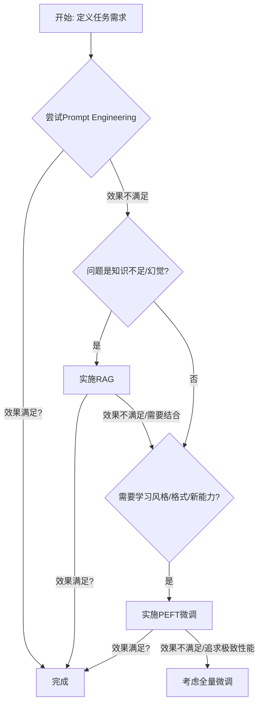

在上一章中，我们已经领略了大语言模型（LLM）的宏大图景。我们知道，像Llama、Qwen这样的开源LLM，是在海量的通用文本上预训练出来的“通用大脑”，它们知识渊博，能力强大。通过精巧的Prompt Engineering，我们已经可以在许多任务上引导它们给出令人满意的结果。

然而，在许多真实的商业场景中，我们面临的挑战更为具体和深入：

- 我们需要一个能理解并使用公司内部术语和黑话的客服机器人。
- 我们需要一个能模仿特定作家风格，进行创意写作的助手。
- 我们需要一个能精准地将自然语言查询，转换为特定数据库查询语言（如SQL）的代码生成器。

在这些场景下，仅仅依靠Prompt Engineering可能力不从心。通用的LLM或许能理解“什么是数据库”，但它不知道你公司内部那张错综复杂的“用户行为表”的具体结构。这时，我们就需要一种更强大的技术，来将这个“通用大脑”改造为我们需要的“领域专家”。这项技术，就是微调（Fine-tuning）。

微调，顾名思义，就是在预训练好的大模型基础上，使用我们自己准备的、与特定任务或领域相关的少量数据，对模型的参数进行“微小”的调整。这个过程，就像是给一位博学的通才，进行一次针对性的岗前培训，使其快速掌握特定岗位所需的专业知识和技能。

但是，传统的全量微调（Full Fine-tuning）——即更新模型的所有参数——对于动辄数十亿甚至上百亿参数的LLM来说，是一场极其昂贵的“豪赌”。它不仅需要海量的GPU显存（例如，微调一个70B模型可能需要8张A100 80G显卡），还会产生一个与原始模型同样大小的、全新的模型副本，这在存储和部署上都是巨大的负担。

幸运的是，研究者们提出了一系列参数高效微调（Parameter-Efficient Fine-Tuning, PEFT）技术，彻底改变了这一局面。PEFT的核心思想是：在微调时，冻结原始LLM的大部分参数，只引入或修改一小部分（通常不到1%）的新参数。这使得我们能够以极低的资源成本（甚至在单张消费级显卡上），实现与全量微调相媲美甚至更好的效果。

本章，我们将深入探索这个激动人心的领域。我们将学习：

- 微调的原理：我们将明确为什么要微调，以及在什么时机选择微调，而不是依赖Prompt或RAG。
- PEFT技术概览：我们将鸟瞰Prefix-Tuning, P-Tuning, Prompt Tuning等主流PEFT方法，理解它们的核心思想。
- LoRA与QLoRA：我们将重点剖析当前最流行、最实用的PEFT方法——LoRA（Low-Rank Adaptation），并学习其进一步降低资源消耗的变体QLoRA。我们将深入其数学原理，并给出清晰的代码实现。
- 数据工程：高质量的数据是微调成功的关键。我们将学习如何构建符合特定格式的指令微调数据集，这是“喂给”模型进行学习的“精神食粮”。
- 实战项目：我们将通过一个完整的实战项目——使用LoRA技术，在单张GPU上微调一个7B规模的开源LLM，使其能够完成特定领域的问答任务——将本章所有知识点融会贯通。

掌握了高效微调技术，你就拥有了将通用AI转化为专用AI的“点金石”。你将能够以可控的成本，为你的业务场景打造出独一无二的、具有强大竞争力的专属大模型。现在，让我们开始这场“驯服”巨兽的精彩旅程。

## 8.1 微调的原理：为什么要微调，何时微调？

### 8.1.1 什么是微调？

微调（Fine-tuning）是在一个已经过大规模数据预训练的模型（Pre-trained Model）的基础上，使用一个更小、更具针对性的数据集，继续进行训练，以使模型适应特定任务或领域的过程。

这个过程可以类比于人类学习：

- 预训练：相当于一个人接受了从小学到大学的通识教育，学习了语言、数学、历史、科学等海量通用知识。这个阶段塑造了他的世界观和基础认知能力。LLM的预训练就是在互联网级别的文本上完成的。
- 微调：相当于这个人大学毕业后，进入一家律师事务所工作。他需要学习法律术语、案例分析方法、法庭辩论技巧等专业知识。这个“岗前培训”就是微调。他利用自己强大的通用语言和逻辑能力，快速地吸收了法律领域的专业知识，成为了一名律师。

在微调过程中，模型的权重不再是随机初始化的，而是继承自预训练阶段。我们使用特定任务的数据（例如，法律问答对），以一个较小的学习率继续进行梯度下降，对这些权重进行“微调”，使其更符合新任务的分布。

### 8.1.2 为什么要微调？—— 微调的收益

既然我们已经有了Prompt Engineering和RAG（检索增强生成），为什么还需要微调这么“重”的操作？微调能带来一些独特且不可替代的价值：

1. 注入领域知识（Domain Knowledge）：这是微调最核心的价值之一。虽然RAG可以为模型提供外部知识，但微调能将知识内化（Internalize）到模型的参数中。这使得模型能够更自然、更流畅地使用专业术语，理解领域内的微妙关系。例如，通过在医学文献上微调，模型能学会像医生一样思考和表达。

2. 学习特定风格或格式（Style/Format Adaptation）：如果你希望模型生成的文本具有某种特定的风格（如莎士比亚风格、公司官方口吻）或遵循某种复杂的输出格式（如生成特定的JSON或XML结构），微调是比在Prompt中反复描述更可靠、更高效的方法。模型会从数据中“学会”这种模式。

3. 掌握新能力（Capability Acquisition）：有些能力很难通过Prompt来教会。例如，将自然语言转换为一种公司自研的、从未在互联网上出现过的DSL（领域特定语言）。通过提供大量的（自然语言，DSL）配对数据进行微调，模型可以学会这种新的“翻译”能力。

4. 提升可靠性与一致性：对于需要大规模、重复执行的任务，依赖复杂的Few-shot Prompt可能导致输出不稳定。微调后的模型，其行为更加可预测和一致，减少了对超长、精巧Prompt的依赖。

5. 优化推理成本：一个经过微调的、更小的模型（如7B），在特定任务上的表现可能超过一个需要复杂Few-shot Prompt的、更大的通用模型（如70B）。在生产环境中，使用更小的模型意味着更低的推理延迟和成本。同时，微调后，你的Prompt可以变得更短、更简单，这也减少了每次API调用的token消耗。

### 8.1.3 何时微调？—— 技术选型决策

微调并非万能药，它需要成本（数据、计算、时间）。在决定是否微调前，应该先尝试更轻量级的方法。一个典型的技术选型路径如下：

第一步：Prompt Engineering (零成本)

对于简单的、一次性的任务，或者当你刚开始探索一个新场景时，首先尝试通过精心设计的Prompt（包括Zero-shot, Few-shot, CoT等技巧）来解决问题。

适用场景：通用问答、简单摘要、文本润色、创意生成等。

如果效果满足要求，就此打住。

第二步：检索增强生成 (RAG) (中等成本)

如果模型的主要问题是“知识不足”或“产生幻觉”（例如，回答关于公司内部产品的问题，或最新的新闻事件），那么RAG是首选。

适用场景：构建基于私有知识库的问答系统、需要引用信源的报告生成、需要实时信息的任务。

成本：需要构建和维护一个知识库及检索系统。

如果RAG能解决问题，通常也无需微调。 RAG和微调并不互斥，可以结合使用（先微调模型以适应领域语言风格，再通过RAG提供实时知识）。

第三步：高效参数微调 (PEFT) (中高成本)

当你尝试了前两步，但模型仍然无法满足以下需求时，就应该考虑微调了：

- 需要深度适应领域术语和语言风格。
- 需要学习一种新的、复杂的输出格式或能力。
- 在特定任务上的性能、可靠性要求极高。
- 需要通过压缩Prompt或使用更小模型来优化推理成本。

成本：需要收集和标注高质量的微调数据集，并投入一定的计算资源。

第四步：全量微调 (Full Fine-tuning) (极高成本)

在PEFT技术成熟的今天，全量微调的需求场景已经大大减少。通常只在以下情况考虑：

- 你有海量的、高质量的领域数据。
- 你的任务与模型的原始预训练任务差异巨大。
- 你追求极致的性能，并且不计成本。
- 在大多数情况下，PEFT都是比全量微调更具性价比的选择。

决策流程图：



## 8.2 参数高效微调（PEFT）概览

PEFT的核心思想是：在微调过程中，保持预训练模型的主体参数`Φ`不变（冻结），只调整一小部分额外添加的、或者选择性解冻的参数`Δθ`。由于`|Δθ| << |Φ|`，这极大地降低了计算和存储的开销。

根据修改参数的位置和方式，PEFT方法可以分为三大类：

### 8.2.1 Adapter-based方法：在模型中“插入”新模块

代表方法：Adapter Tuning

思想：在Transformer的每个Layer内部，插入两个小型的、瓶颈结构的前馈神经网络模块（称为Adapter）。在微调时，只训练这些新插入的Adapter模块的参数，而原始的自注意力层和前馈网络层都被冻结。

优点：实现简单，效果稳定。

缺点：插入的Adapter模块会增加模型的推理延迟。

### 8.2.2 Prompt-based方法：在输入端“添加”可学习的提示

这类方法不在模型结构上动刀，而是在输入层做文章。

代表方法：Prefix-Tuning, P-Tuning, Prompt Tuning

思想：

- Prompt Tuning：在输入的词嵌入序列前面，拼接上一些可学习的、连续的“虚拟token”（Soft Prompt）。在微调时，只更新这些虚拟token的嵌入向量，而模型的其他所有部分（包括词嵌入层）都保持冻结。
- Prefix-Tuning / P-Tuning：与Prompt Tuning类似，但它们将这些可学习的“前缀”添加到了Transformer的每一层，而不仅仅是输入层，从而给予模型更大的调整自由度。

优点：不改变模型结构，不增加推理延迟。

缺点：性能有时不如Adapter方法稳定，且可学习的Prompt长度是一个难以调整的超参数。

### 8.2.3 Reparameterization-based方法：对权重矩阵进行“低秩”修改

这类方法是目前最主流、效果最好的PEFT范式。

代表方法：LoRA (Low-Rank Adaptation)

思想：它基于一个假设——在微调过程中，模型权重的变化是“低秩”的。也就是说，巨大的权重更新矩阵`ΔW`，可以用两个更小的、低秩的矩阵`A`和`B`的乘积来近似：`ΔW ≈ B * A`。

实现：在微调时，LoRA冻结原始的权重矩阵`W`，并在其旁边并联一个由矩阵`A`和`B`组成的“旁路”。我们只训练`A`和`B`的参数。在推理时，可以将训练好的`B*A`与原始的`W`合并（`W' = W + B*A`），从而完全不增加任何推理延迟。

优点：性能非常接近全量微调，且推理时无额外开销。实现灵活，可以应用到任意线性层。

缺点：暂无明显缺点，已成为PEFT的事实标准。

我们将在下一节详细剖析LoRA的原理与实现。

## 8.3 LoRA与QLoRA：原理与代码实现

### 8.3.1 LoRA (Low-Rank Adaptation) 的核心原理

假设我们有一个预训练的权重矩阵 `W₀ ∈ R^(d×k)`（例如，Transformer中Q, K, V投影的线性层权重）。在全量微调中，我们会更新这个矩阵，得到 `W₀ + ΔW`。LoRA的核心洞察是，这个更新矩阵 `ΔW` 具有很低的“内在秩”（intrinsic rank），即它可以用更少的信息来表示。

LoRA的做法是，使用两个低秩矩阵 `B ∈ R^(d×r)` 和 `A ∈ R^(r×k)` 来表示 `ΔW`，其中秩 `r` 是一个远小于 `d` 和 `k` 的超参数（例如 `r=8, 16, 64`）。

前向传播过程的变化：

- 原始路径：`h = W₀ * x`
- LoRA路径：`h = W₀ * x + B * A * x`

为了进一步降低计算量，LoRA还引入了一个缩放因子 `α`：`h = W₀ * x + (α/r) * B * A * x`

训练过程：

1. 冻结原始权重 `W₀`。
2. 随机初始化矩阵 `A`（例如，高斯分布）和矩阵 `B`（初始化为0）。
3. 在微调过程中，只更新 `A` 和 `B` 的参数。

可训练参数量对比：

- 全量微调：`d * k`
- LoRA：`r * d + r * k = r * (d + k)`

由于 `r << d` 且 `r << k`，LoRA的可训练参数量极大地减少了。例如，对于一个`4096×4096`的矩阵，全量微调需要更新约16.7M参数。如果使用`r=8`的LoRA，只需要更新`8 * (4096 + 4096) ≈ 65k`参数，减少了超过250倍！

推理过程（合并权重）：

训练完成后，我们可以将LoRA的旁路合并回主干，实现零额外推理延迟。

1. 计算训练好的 `ΔW = (α/r) * B * A`。
2. 计算新的权重矩阵 `W' = W₀ + ΔW`。
3. 在部署时，直接使用这个合并后的权重矩阵 `W'`，完全丢弃 `A` 和 `B`。

### 8.3.2 QLoRA：在消费级GPU上微调巨型模型

LoRA已经极大地降低了微调的门槛，但对于非常大的模型（如70B），加载模型本身就需要巨大的显存。QLoRA (Quantized LoRA) 进一步将资源消耗推向了极致。

QLoRA结合了两种技术：

1. 4-bit NormalFloat (NF4) 量化：这是QLoRA的核心创新。它将预训练模型的冻结权重（即`W₀`）从标准的16位浮点数（FP16）或32位浮点数（FP32），量化为一种新的4位数据类型（NF4）。这使得加载模型所需的显存减少了约4倍。例如，一个7B模型，FP16需要约14GB显存，而4-bit量化后只需要约4-5GB。
2. 双重量化（Double Quantization）：为了进一步节省内存，QLoRA对量化过程中产生的“量化常数”本身，也进行了二次量化。
3. Paged Optimizers：利用NVIDIA统一内存的特性，防止在处理长序列导致梯度检查点（gradient checkpointing）内存激增时，出现显存不足（OOM）的错误。

QLoRA的训练过程：

1. 将预训练模型的权重以4-bit NF4格式加载到GPU。
2. 插入LoRA适配器（矩阵A和B）。
3. 在训练时，只有LoRA的参数（A和B）是以高精度（如FP16）进行计算和更新的。
4. 当进行前向和反向传播，需要用到原始权重`W₀`时，系统会动态地将4-bit的权重反量化（de-quantize）为FP16，进行计算，计算完毕后立即丢弃，内存中始终只保留4-bit的权重。

通过这种方式，QLoRA在保持了与16-bit LoRA微调几乎相同性能的同时，极大地降低了显存的峰值占用，使得在单张24GB的消费级显卡（如RTX 3090/4090）上微调65B模型成为可能。

### 8.3.3 使用`peft`库实现LoRA/QLoRA

Hugging Face的`peft`库极大地简化了PEFT方法的实现。

```python
from transformers import AutoModelForCausalLM, AutoTokenizer, BitsAndBytesConfig
from peft import get_peft_model, LoraConfig, TaskType

# 模型名称
model_name = "meta-llama/Llama-2-7b-hf"

# --- QLoRA 配置 ---
# 1. BitsAndBytesConfig 用于4-bit量化
bnb_config = BitsAndBytesConfig(
    load_in_4bit=True,
    bnb_4bit_use_double_quant=True,
    bnb_4bit_quant_type="nf4",
    bnb_4bit_compute_dtype=torch.bfloat16 # 计算时使用的类型
)

# 2. 加载量化后的模型
model = AutoModelForCausalLM.from_pretrained(
    model_name,
    quantization_config=bnb_config,
    device_map="auto" # 自动将模型分配到可用设备
)

# 加载分词器
tokenizer = AutoTokenizer.from_pretrained(model_name)
tokenizer.pad_token = tokenizer.eos_token # 设置pad token

# --- LoRA 配置 ---
# 3. LoraConfig
peft_config = LoraConfig(
    task_type=TaskType.CAUSAL_LM, # 任务类型：因果语言模型
    r=8,                          # LoRA的秩
    lora_alpha=32,                # LoRA的alpha参数
    lora_dropout=0.1,             # LoRA层的dropout率
    # 指定要应用LoRA的模块名称，通常是Q和V的投影层
    target_modules=["q_proj", "v_proj"], 
    bias="none"
)

# 4. 使用get_peft_model将LoRA应用到模型上
peft_model = get_peft_model(model, peft_config)

# 打印可训练参数
peft_model.print_trainable_parameters()
# 输出: trainable params: 4,194,304 || all params: 6,742,609,920 || trainable%: 0.0622...
```

只需短短几行代码，我们就将一个巨大的LLM转换为了一个轻量的、可微调的PEFT模型。接下来，我们就可以像训练普通PyTorch模型一样，使用`transformers.Trainer`或自定义训练循环来训练这个`peft_model`了。

## 8.4 数据工程：构建高质量的指令微调数据集

“Garbage in, garbage out.”（垃圾进，垃圾出。）这句话在LLM微调中体现得淋漓尽致。数据集的质量，是决定微调成败的最关键因素。

指令微调（Instruction-Tuning）是当前最主流的微调范式。其核心思想是，将各种任务都转化为“指令-响应”的格式，让模型学会遵循人类的指令。

### 8.4.1 数据集格式

一个典型的指令微调数据集，通常是一个JSONL文件（每行一个JSON对象），每个JSON对象包含以下字段：
`instruction`：对任务的清晰描述。
`input`（可选）：任务的上下文或输入。
`output`：期望模型生成的标准答案。

示例：

1. 无`input`的问答任务

    ```json
    {"instruction": "中国的首都是哪里？", "input": "", "output": "中国的首都是北京。"}
    ```

2. 有`input`的分类任务

    ```json
    {"instruction": "请判断以下句子的情感是正面、负面还是中性。", "input": "这家餐厅的食物味道很棒，但服务太慢了。", "output": "中性"}
    ```

3. 代码生成任务

    ```json
    {"instruction": "编写一个Python函数，计算斐波那契数列的第n项。", "input": "n = 10", "output": "def fibonacci(n):\n  if n <= 1:\n    return n\n  else:\n    return fibonacci(n-1) + fibonacci(n-2)"}
    ```

### 8.4.2 Prompt模板化

在将数据喂给模型前，我们需要将这些结构化的字段，组合成一个单一的文本字符串，这个过程称为Prompt模板化。一个好的模板，能够清晰地向模型展示任务的结构。

一个常用的模板（Alpaca格式）：

```text
Below is an instruction that describes a task. Write a response that appropriately completes the request.

### Instruction:
{instruction}

### Input:
{input}

### Response:
{output}
```

如果`input`为空，则`### Input:`部分可以省略。在训练时，模型的目标就是根据`Instruction`和`Input`，去生成`Response`部分的内容。

### 8.4.3 构建高质量数据集的原则

1. 质量远比数量重要：几百条高质量、精心设计的数据，其效果可能远超数万条低质量、有噪声的数据。
2. 多样性：
    指令多样性：同一个任务，可以用多种不同的方式来提问。例如，“总结这篇文章”、“给这篇文章写个摘要”、“这篇文章的核心观点是什么？”。
    输入多样性：覆盖各种可能的输入场景、边缘情况。
    响应多样性：对于开放式问题，答案也应该是多样的。
3. 清晰无歧义：指令应该清晰、明确，避免含糊不清的描述。
4. 正确性：`output`必须是绝对正确的标准答案。
5. 简洁性：在保证清晰的前提下，指令和输入应尽可能简洁。

### 8.4.4 数据来源

使用现有开源数据集：

- Alpaca：斯坦福大学发布的52k条指令数据，由GPT-3.5生成，是指令微调的开山之作。
- Dolly：由Databricks员工众包生成的15k条高质量指令数据。
- Open-Orca：一个包含数百万条由更强模型（如GPT-4）生成的指令数据的大型数据集。

自己生成数据：

- 人工标注：成本最高，但质量最好。由领域专家亲自编写指令和答案。
- 使用强模型（如GPT-4）生成：设计一些高质量的“种子Prompt”，然后让GPT-4围绕你的领域，生成大量的问答对、分类、摘要等数据。这是目前最常用、性价比最高的方法。但需要注意，生成的数据必须经过人工的严格筛选和修正。

从现有文档中提取：将公司的FAQ、产品手册、API文档等，转化为问答对的形式。

## 8.5 实战项目：使用LoRA微调一个7B模型以完成特定领域的问答任务

项目目标：我们将使用一个关于“人工智能基础知识”的自定义小型数据集，通过QLoRA技术，微调一个7B的开源模型（如Llama 3 8B或Qwen 7B），使其能够准确地回答相关的AI概念问题。

技术栈：

- `transformers`
- `peft`
- `accelerate` (用于分布式训练和设备管理)
- `bitsandbytes` (用于QLoRA)
- `datasets` (用于加载和处理数据)

第一步：准备数据集 (`ai_knowledge_qa.jsonl`)

```json
{"instruction": "什么是神经网络？", "input": "", "output": "神经网络是一种模仿生物大脑结构和功能的计算模型，由大量的、称为神经元的人工节点组成，这些节点按层次结构组织。它通过在大量数据上进行训练来学习和识别模式。"}
{"instruction": "请解释什么是反向传播。", "input": "", "output": "反向传播是一种在神经网络中训练模型的核心算法。它通过计算损失函数相对于网络各参数的梯度，然后使用梯度下降等优化算法来更新权重，从而最小化预测误差。"}
{"instruction": "Transformer模型的核心思想是什么？", "input": "", "output": "Transformer模型的核心思想是自注意力机制（Self-Attention）。它完全抛弃了传统的循环（RNN）和卷积（CNN）结构，允许模型在处理序列中的一个词时，直接计算并关注到序列中所有其他词的重要性，从而高效地捕捉长距离依赖关系。"}
... (准备100-500条类似的数据)
```

第二步：编写微调脚本 (`finetune.py`)

```python
import torch
from datasets import load_dataset
from transformers import (
    AutoModelForCausalLM,
    AutoTokenizer,
    BitsAndBytesConfig,
    TrainingArguments,
    Trainer,
)
from peft import LoraConfig, get_peft_model

# --- 1. 加载模型和分词器 (QLoRA配置) ---
model_name = "meta-llama/Llama-3-8B" # 或其他7B/8B模型

bnb_config = BitsAndBytesConfig(
    load_in_4bit=True,
    bnb_4bit_quant_type="nf4",
    bnb_4bit_compute_dtype=torch.bfloat16,
    bnb_4bit_use_double_quant=True,
)

model = AutoModelForCausalLM.from_pretrained(
    model_name,
    quantization_config=bnb_config,
    device_map="auto",
)
model.config.use_cache = False # 在训练时关闭cache

tokenizer = AutoTokenizer.from_pretrained(model_name, trust_remote_code=True)
tokenizer.pad_token = tokenizer.eos_token
tokenizer.padding_side = "right"

# --- 2. LoRA配置 ---
peft_config = LoraConfig(
    r=16,
    lora_alpha=32,
    lora_dropout=0.05,
    target_modules=["q_proj", "k_proj", "v_proj", "o_proj", "gate_proj", "up_proj", "down_proj"],
    task_type="CAUSAL_LM",
)

peft_model = get_peft_model(model, peft_config)
peft_model.print_trainable_parameters()

# --- 3. 加载和预处理数据集 ---
dataset = load_dataset("json", data_files="ai_knowledge_qa.jsonl", split="train")

def format_prompt(example):
    # Alpaca prompt模板
    prompt = f"""Below is an instruction that describes a task. Write a response that appropriately completes the request.

### Instruction:
{example['instruction']}

### Response:
{example['output']}"""
    return {"text": prompt}

dataset = dataset.map(format_prompt)

# --- 4. 设置训练参数 ---
training_arguments = TrainingArguments(
    output_dir="./results",
    num_train_epochs=3,
    per_device_train_batch_size=4,
    gradient_accumulation_steps=1,
    optim="paged_adamw_32bit",
    learning_rate=2e-4,
    weight_decay=0.001,
    fp16=False,
    bf16=True, # 如果你的GPU支持bf16，强烈推荐
    max_grad_norm=0.3,
    max_steps=-1,
    warmup_ratio=0.03,
    group_by_length=True,
    lr_scheduler_type="constant",
    logging_steps=25,
)

# --- 5. 初始化Trainer并开始训练 ---
trainer = Trainer(
    model=peft_model,
    train_dataset=dataset,
    args=training_arguments,
    # DataCollatorForLanguageModeling 会自动处理padding和masking
    data_collator=lambda data: {'input_ids': tokenizer([x['text'] for x in data], return_tensors='pt', padding=True, truncation=True, max_length=512).input_ids,
                                'labels': tokenizer([x['text'] for x in data], return_tensors='pt', padding=True, truncation=True, max_length=512).input_ids},
)

trainer.train()

# --- 6. 保存微调后的模型 ---
# 只保存LoRA适配器的权重，非常小
trainer.model.save_pretrained("./results/final_checkpoint")
tokenizer.save_pretrained("./results/final_checkpoint")
```

第三步：运行与推理

1. 运行训练：`python finetune.py`
2. 推理：编写一个`inference.py`脚本，加载基础模型和微调后的LoRA权重，进行问答。

    ```python
    from peft import PeftModel
    # ... 加载基础模型和分词器 (同上) ...

    # 加载LoRA权重并合并
    model = PeftModel.from_pretrained(model, "./results/final_checkpoint")
    model = model.merge_and_unload() # 合并权重以便快速推理

    # 进行推理
    instruction = "请解释一下什么是LoRA？"
    prompt = f"""Below is an instruction that describes a task. Write a response that appropriately completes the request.

    ### Instruction

    {instruction}

    ### Response

    """
  
    inputs = tokenizer(prompt, return_tensors="pt").to("cuda")
    outputs = model.generate(inputs, max_new_tokens=200)
    response = tokenizer.decode(outputs[0], skip_special_tokens=True)
  
    print(response)
    ```

运行推理脚本后，你会发现，模型能够以一种非常专业和准确的方式，回答关于LoRA的问题，这正是它从我们的自定义数据集中学到的新知识和表达方式。

## 本章小结

在本章中，我们深入掌握了定制化大模型的关键技术——高效参数微调。

我们首先明确了微调的价值与时机，建立了一套从Prompt Engineering到RAG，再到PEFT的清晰技术选型路径。

接着，我们系统地学习了PEFT的核心思想，并重点剖析了当前最强大、最流行的LoRA及其低资源变体QLoRA的数学原理和工程实现。我们理解了如何通过低秩分解和4-bit量化，在消费级硬件上“驯服”数十亿参数的巨型模型。

我们还强调了数据工程在微调中的决定性作用，学习了如何构建高质量的指令微调数据集，并将其转化为模型能够学习的Prompt格式。

最后，通过一个端到端的实战项目，我们将所有理论知识付诸实践，亲手使用QLoRA微调了一个7B规模的大模型，使其成为了一个AI领域的问答专家。这个过程，让你完整地体验了从数据准备、模型配置、训练执行到最终推理的全流程。

完成本章后，你已经不再仅仅是LLM的使用者，你已经成为了一名能够根据业务需求，亲手“雕琢”和“塑造”大模型的AI工程师。这项能力，是你在大模型时代构建核心竞争力的关键。在下一章，我们将探索另一个与微调相辅相成的强大范式——检索增强生成（RAG），学习如何为大模型装上一个能够连接实时、私有知识库的“外挂大脑”。
